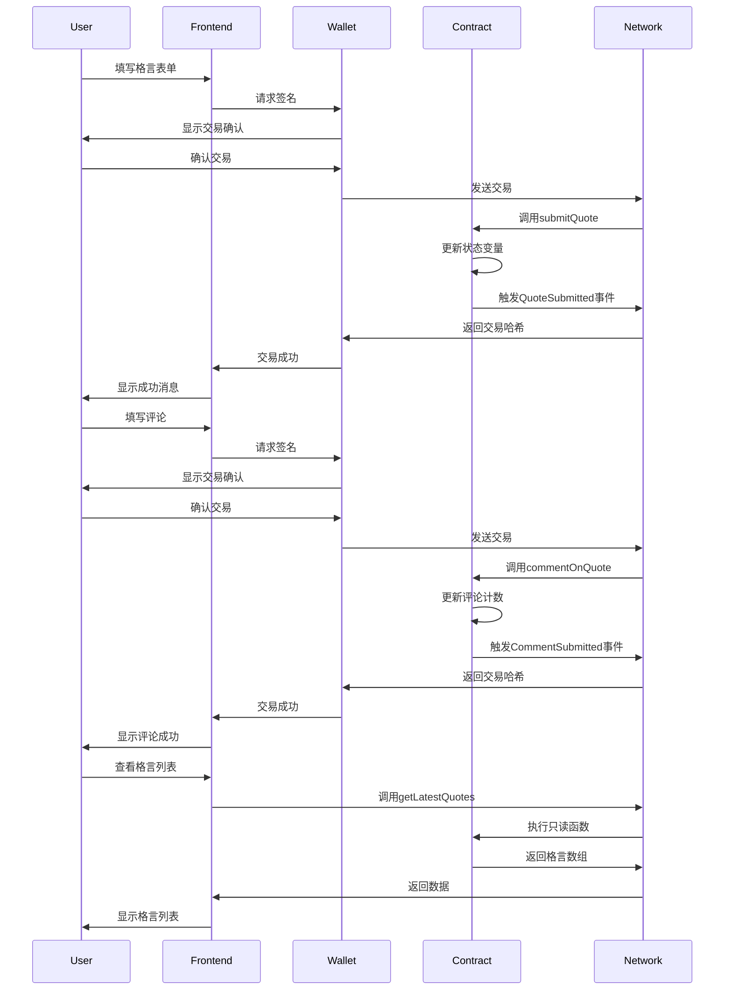
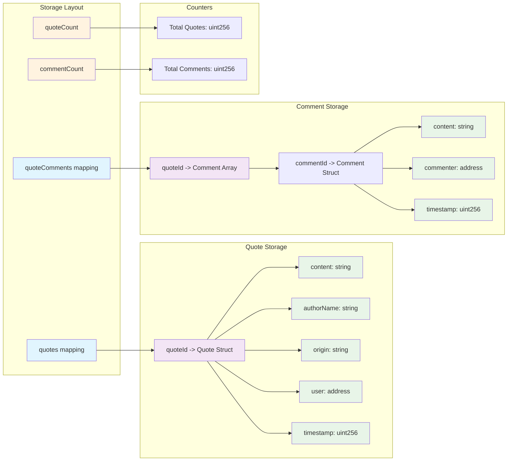
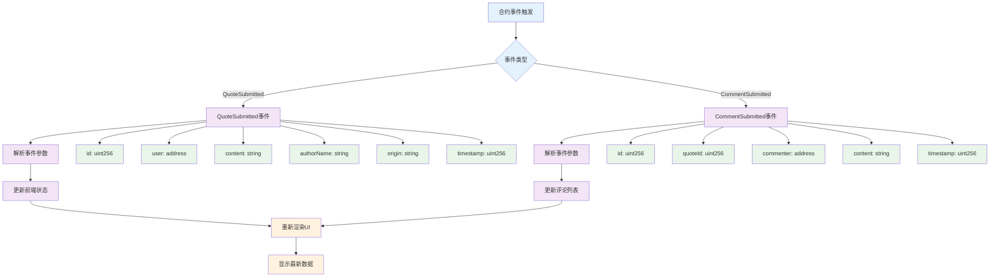
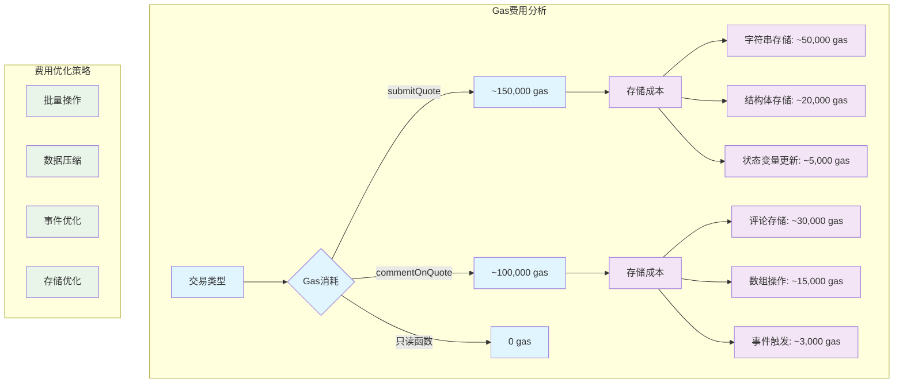
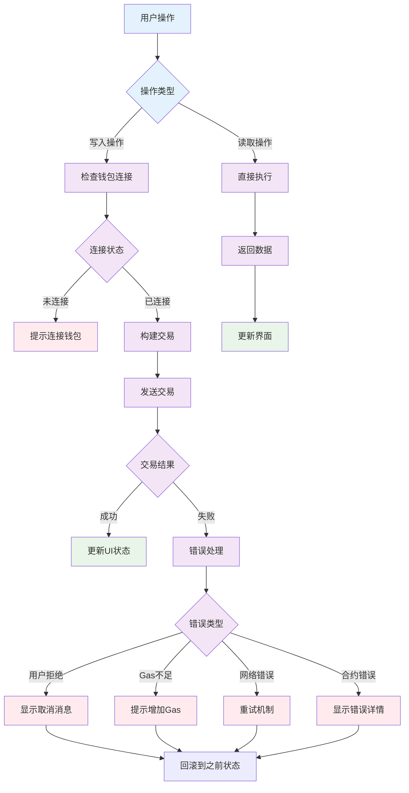
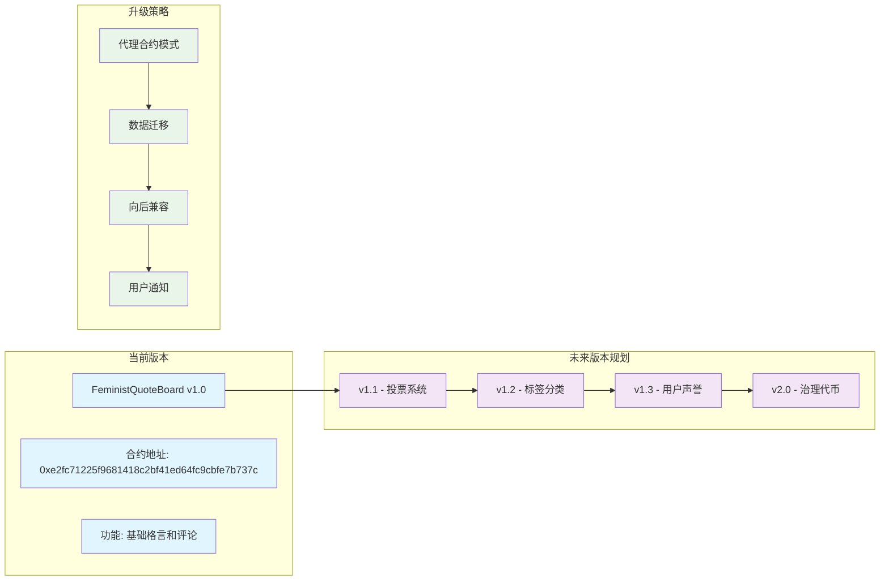

# 智能合约详细交互图

## 1. 智能合约结构图

```mermaid
graph TB
    subgraph "FeministQuoteBoard Contract"
        A[Contract Address: 0xe2fc71225f9681418c2bf41ed64fc9cbfe7b737c]
        
        subgraph "Data Structures"
            B[Quote Struct]
            C[Comment Struct]
            D[State Variables]
        end
        
        subgraph "Write Functions"
            E[submitQuote]
            F[commentOnQuote]
        end
        
        subgraph "Read Functions"
            G[getLatestQuotes]
            H[getQuote]
            I[getCommentsByQuote]
            J[getQuoteCount]
            K[commentCount]
        end
        
        subgraph "Events"
            L[QuoteSubmitted]
            M[CommentSubmitted]
        end
    end
    
    %% Quote Struct Details
    B --> B1[id: uint256]
    B --> B2[content: string]
    B --> B3[authorName: string]
    B --> B4[origin: string]
    B --> B5[user: address]
    B --> B6[timestamp: uint256]
    
    %% Comment Struct Details
    C --> C1[id: uint256]
    C --> C2[quoteId: uint256]
    C --> C3[commenter: address]
    C --> C4[content: string]
    C --> C5[timestamp: uint256]
    
    %% State Variables
    D --> D1[quoteCount: uint256]
    D --> D2[commentCount: uint256]
    D --> D3[quotes: mapping]
    D --> D4[quoteComments: mapping]
    
    %% Connections
    E --> L
    F --> M
    G --> B
    H --> B
    I --> C
    
    %% Styling
    classDef contract fill:#e3f2fd
    classDef struct fill:#f3e5f5
    classDef function fill:#e8f5e8
    classDef event fill:#fff3e0
    classDef variable fill:#fce4ec
    
    class A contract
    class B,C struct
    class E,F,G,H,I,J,K function
    class L,M event
    class D variable
```

## 2. 合约函数调用流程图

## 3. 数据存储映射图

## 4. 事件监听和处理流程

## 5. Gas费用估算图

## 6. 错误处理和回滚机制

## 7. 合约升级和版本管理

---

## 智能合约技术特点

### 1. 数据结构设计
- **Quote结构体**：包含完整的格言信息
- **Comment结构体**：支持多级评论系统
- **映射存储**：高效的键值对存储

### 2. 函数设计
- **写入函数**：需要用户签名和Gas费用
- **读取函数**：免费调用，实时返回数据
- **事件系统**：完整的事件记录和监听

### 3. 安全机制
- **访问控制**：只有合约所有者可以修改关键参数
- **输入验证**：防止恶意输入和溢出攻击
- **错误处理**：完善的错误回滚机制

### 4. Gas优化
- **批量操作**：减少多次交易的Gas消耗
- **存储优化**：合理使用存储空间
- **事件优化**：使用indexed参数提高查询效率

### 5. 可扩展性
- **模块化设计**：便于功能扩展
- **版本管理**：支持合约升级
- **数据迁移**：保证数据连续性 