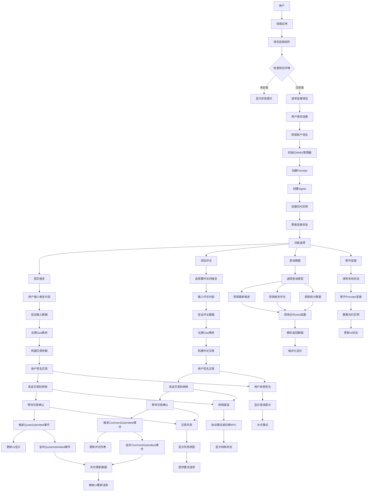

# 钱包/合约交互路径图（Wallet Interaction Flow）

## 项目概述
Feminist Quote Board 的钱包交互系统，支持用户通过 Web3 钱包与以太坊智能合约进行交互，实现去中心化的格言提交和评论功能。

## 智能合约信息
- **合约地址**: `0xe2fc71225f9681418c2bf41ed64fc9cbfe7b737c`
- **网络**: 以太坊主网
- **合约名称**: FeministQuoteBoard
- **主要功能**: 格言提交、评论系统、数据查询

## 钱包/合约交互路径图



## 详细交互流程

### 1. 钱包连接流程

#### 1.1 环境检查
```typescript
// components/wallet-connect.tsx
if (!window.ethereum) {
  // 显示安装提示
  return <InstallWalletPrompt />
}
```

#### 1.2 连接请求
```typescript
// lib/web3.ts - Web3Manager.connectWallet()
async connectWallet(): Promise<string> {
  // 1. 检查ethereum对象
  if (!window.ethereum) {
    throw new Error("请安装MetaMask钱包")
  }
  
  // 2. 请求账户连接
  const accounts = await window.ethereum.request({
    method: 'eth_requestAccounts'
  })
  
  // 3. 获取第一个账户
  const account = accounts[0]
  
  // 4. 创建Provider和Signer
  this.provider = new ethers.BrowserProvider(window.ethereum)
  this.signer = await this.provider.getSigner()
  
  // 5. 创建合约实例
  this.contract = new ethers.Contract(
    CONTRACT_ADDRESS,
    CONTRACT_ABI,
    this.signer
  )
  
  return account
}
```

### 2. 格言提交流程

#### 2.1 数据验证
```typescript
// 前端验证
if (!content.trim()) {
  throw new Error("格言内容不能为空")
}
if (content.length > 500) {
  throw new Error("格言内容过长")
}
```

#### 2.2 交易构建
```typescript
// lib/web3.ts - submitQuote()
export async function submitQuote(
  content: string, 
  authorName: string, 
  origin: string
): Promise<void> {
  const contract = web3Manager.getContract()
  
  // 构建交易参数
  const tx = await contract.submitQuote(content, authorName, origin)
  
  // 等待交易确认
  const receipt = await tx.wait()
  
  // 验证交易成功
  if (receipt.status === 0) {
    throw new Error("交易失败")
  }
}
```

#### 2.3 Gas费用估算
```typescript
// Gas费用估算
const estimatedGas = await contract.submitQuote.estimateGas(
  content, authorName, origin
)

// 获取当前Gas价格
const gasPrice = await provider.getFeeData()

// 计算总费用
const totalCost = estimatedGas * gasPrice.gasPrice
```

### 3. 评论系统流程

#### 3.1 评论提交
```typescript
// lib/web3.ts - commentOnQuote()
export async function commentOnQuote(
  quoteId: number, 
  content: string
): Promise<void> {
  const contract = web3Manager.getContract()
  
  // 验证格言存在
  const quote = await contract.getQuote(quoteId)
  if (!quote.content) {
    throw new Error("格言不存在")
  }
  
  // 提交评论
  const tx = await contract.commentOnQuote(quoteId, content)
  await tx.wait()
}
```

#### 3.2 评论查询
```typescript
// lib/web3.ts - getCommentsByQuote()
export async function getCommentsByQuote(
  quoteId: number
): Promise<Comment[]> {
  const contract = await web3Manager.getReadOnlyContract()
  
  const comments = await contract.getCommentsByQuote(quoteId)
  
  return comments.map(comment => ({
    id: Number(comment.id),
    quoteId: Number(comment.quoteId),
    commenter: comment.commenter,
    content: comment.content,
    timestamp: Number(comment.timestamp)
  }))
}
```

### 4. 数据查询流程

#### 4.1 只读合约实例
```typescript
// lib/web3.ts - getReadOnlyContract()
async getReadOnlyContract(): Promise<ethers.Contract> {
  if (!this.readOnlyProvider) {
    // 使用公共RPC端点创建只读Provider
    this.readOnlyProvider = new ethers.JsonRpcProvider(
      "https://eth.llamarpc.com"
    )
  }
  
  return new ethers.Contract(
    CONTRACT_ADDRESS,
    CONTRACT_ABI,
    this.readOnlyProvider
  )
}
```

#### 4.2 批量数据获取
```typescript
// lib/web3.ts - getLatestQuotes()
export async function getLatestQuotes(limit = 50): Promise<Quote[]> {
  const contract = await web3Manager.getReadOnlyContract()
  
  // 获取格言总数
  const totalQuotes = await contract.quoteCount()
  
  // 计算起始索引
  const startIndex = Math.max(0, totalQuotes - limit)
  
  // 批量获取格言
  const quotes = []
  for (let i = startIndex; i < totalQuotes; i++) {
    const quote = await contract.getQuote(i)
    quotes.push({
      id: Number(quote.id),
      content: quote.content,
      authorName: quote.authorName,
      origin: quote.origin,
      user: quote.user,
      timestamp: Number(quote.timestamp)
    })
  }
  
  return quotes.reverse() // 按时间倒序
}
```

## 智能合约接口

### 合约方法

#### 写入方法（需要签名）
```solidity
// 提交格言
function submitQuote(
    string memory content,
    string memory authorName,
    string memory origin
) external

// 添加评论
function commentOnQuote(
    uint256 quoteId,
    string memory content
) external
```

#### 读取方法（无需签名）
```solidity
// 获取格言
function getQuote(uint256 id) external view returns (Quote memory)

// 获取最新格言
function getLatestQuotes(uint256 limit) external view returns (Quote[] memory)

// 获取评论
function getCommentsByQuote(uint256 quoteId) external view returns (Comment[] memory)

// 获取统计信息
function quoteCount() external view returns (uint256)
function commentCount() external view returns (uint256)
```

### 事件定义
```solidity
// 格言提交事件
event QuoteSubmitted(
    uint256 indexed id,
    address indexed user,
    string content,
    string authorName,
    string origin,
    uint256 timestamp
)

// 评论提交事件
event CommentSubmitted(
    uint256 indexed id,
    uint256 indexed quoteId,
    address indexed commenter,
    string content,
    uint256 timestamp
)
```

## 数据结构

### Quote结构
```solidity
struct Quote {
    uint256 id;           // 格言ID
    string content;       // 格言内容
    string authorName;    // 作者姓名
    string origin;        // 来源
    address user;         // 提交者地址
    uint256 timestamp;    // 提交时间
}
```

### Comment结构
```solidity
struct Comment {
    uint256 id;           // 评论ID
    uint256 quoteId;      // 关联格言ID
    address commenter;    // 评论者地址
    string content;       // 评论内容
    uint256 timestamp;    // 评论时间
}
```

## 错误处理机制

### 1. 钱包连接错误
```typescript
try {
  await web3Manager.connectWallet()
} catch (error) {
  if (error.code === 4001) {
    // 用户拒绝连接
    toast.error("用户拒绝了钱包连接请求")
  } else if (error.code === -32002) {
    // 请求已在进行中
    toast.error("请检查钱包弹窗")
  } else {
    // 其他错误
    toast.error("连接钱包失败: " + error.message)
  }
}
```

### 2. 交易错误处理
```typescript
try {
  const tx = await contract.submitQuote(content, authorName, origin)
  const receipt = await tx.wait()
  
  if (receipt.status === 0) {
    throw new Error("交易执行失败")
  }
} catch (error) {
  if (error.code === 4001) {
    // 用户拒绝签名
    toast.error("用户拒绝了交易签名")
  } else if (error.message.includes("insufficient funds")) {
    // 余额不足
    toast.error("账户余额不足，请检查ETH余额")
  } else if (error.message.includes("gas")) {
    // Gas相关错误
    toast.error("Gas费用设置错误，请重试")
  } else {
    // 其他错误
    toast.error("交易失败: " + error.message)
  }
}
```

### 3. 网络错误处理
```typescript
// 多RPC端点配置
const RPC_ENDPOINTS = [
  "https://eth.llamarpc.com",
  "https://rpc.flashbots.net",
  "https://cloudflare-eth.com"
]

// 自动重试机制
async function createProviderWithRetry() {
  for (const endpoint of RPC_ENDPOINTS) {
    try {
      const provider = new ethers.JsonRpcProvider(endpoint)
      await provider.getNetwork() // 测试连接
      return provider
    } catch (error) {
      console.warn(`RPC端点 ${endpoint} 连接失败，尝试下一个`)
      continue
    }
  }
  throw new Error("所有RPC端点都无法连接")
}
```

## 性能优化

### 1. 批量查询优化
```typescript
// 批量获取多个格言
async function getQuotesBatch(ids: number[]): Promise<Quote[]> {
  const contract = await web3Manager.getReadOnlyContract()
  
  // 并行查询多个格言
  const promises = ids.map(id => contract.getQuote(id))
  const results = await Promise.all(promises)
  
  return results.map((quote, index) => ({
    id: ids[index],
    content: quote.content,
    authorName: quote.authorName,
    origin: quote.origin,
    user: quote.user,
    timestamp: Number(quote.timestamp)
  }))
}
```

### 2. 事件监听优化
```typescript
// 监听合约事件
function setupEventListeners() {
  const contract = web3Manager.getContract()
  
  // 监听格言提交事件
  contract.on("QuoteSubmitted", (id, user, content, authorName, origin, timestamp) => {
    // 实时更新UI
    updateQuotesList({
      id: Number(id),
      content,
      authorName,
      origin,
      user,
      timestamp: Number(timestamp)
    })
  })
  
  // 监听评论提交事件
  contract.on("CommentSubmitted", (id, quoteId, commenter, content, timestamp) => {
    // 实时更新评论列表
    updateCommentsList({
      id: Number(id),
      quoteId: Number(quoteId),
      commenter,
      content,
      timestamp: Number(timestamp)
    })
  })
}
```

### 3. 缓存策略
```typescript
// 本地缓存管理
class QuoteCache {
  private cache = new Map<string, { data: any, timestamp: number }>()
  private readonly TTL = 5 * 60 * 1000 // 5分钟缓存
  
  get(key: string) {
    const item = this.cache.get(key)
    if (item && Date.now() - item.timestamp < this.TTL) {
      return item.data
    }
    return null
  }
  
  set(key: string, data: any) {
    this.cache.set(key, { data, timestamp: Date.now() })
  }
  
  clear() {
    this.cache.clear()
  }
}
```

## 安全考虑

### 1. 输入验证
```typescript
// 严格的输入验证
function validateQuoteInput(content: string, authorName: string, origin: string) {
  if (!content || content.trim().length === 0) {
    throw new Error("格言内容不能为空")
  }
  
  if (content.length > 500) {
    throw new Error("格言内容不能超过500字符")
  }
  
  if (authorName && authorName.length > 100) {
    throw new Error("作者姓名不能超过100字符")
  }
  
  if (origin && origin.length > 200) {
    throw new Error("来源信息不能超过200字符")
  }
  
  // 检查特殊字符
  const dangerousPattern = /<script|javascript:|on\w+\s*=/i
  if (dangerousPattern.test(content) || dangerousPattern.test(authorName) || dangerousPattern.test(origin)) {
    throw new Error("输入包含不允许的字符")
  }
}
```

### 2. 交易安全
```typescript
// 交易确认机制
async function submitQuoteWithConfirmation(content: string, authorName: string, origin: string) {
  // 1. 显示确认对话框
  const confirmed = await showConfirmationDialog({
    title: "确认提交格言",
    content: `内容: ${content}\n作者: ${authorName}\n来源: ${origin}`,
    gasEstimate: "预计Gas费用: 0.001 ETH"
  })
  
  if (!confirmed) {
    return
  }
  
  // 2. 提交交易
  const tx = await contract.submitQuote(content, authorName, origin)
  
  // 3. 显示交易状态
  showTransactionStatus(tx.hash)
  
  // 4. 等待确认
  const receipt = await tx.wait()
  
  // 5. 显示成功消息
  showSuccessMessage("格言提交成功！")
}
```

### 3. 钱包安全
```typescript
// 安全的钱包连接
class SecureWalletManager {
  private connectedAddress: string | null = null
  private connectionTime: number | null = null
  
  async connectWallet(): Promise<string> {
    // 检查是否已经连接
    if (this.isConnected()) {
      return this.connectedAddress!
    }
    
    // 请求连接
    const address = await this.requestConnection()
    
    // 验证地址格式
    if (!ethers.isAddress(address)) {
      throw new Error("无效的钱包地址")
    }
    
    // 记录连接信息
    this.connectedAddress = address
    this.connectionTime = Date.now()
    
    return address
  }
  
  // 定期检查连接状态
  async checkConnectionStatus(): Promise<boolean> {
    if (!this.isConnected()) {
      return false
    }
    
    try {
      const currentAccount = await window.ethereum.request({
        method: 'eth_accounts'
      })
      
      if (currentAccount[0] !== this.connectedAddress) {
        // 账户已切换，需要重新连接
        this.resetConnection()
        return false
      }
      
      return true
    } catch (error) {
      this.resetConnection()
      return false
    }
  }
}
```

## 监控和分析

### 1. 交易监控
```typescript
// 交易状态监控
class TransactionMonitor {
  private pendingTransactions = new Map<string, any>()
  
  async monitorTransaction(txHash: string) {
    this.pendingTransactions.set(txHash, {
      startTime: Date.now(),
      status: 'pending'
    })
    
    try {
      const receipt = await provider.waitForTransaction(txHash)
      
      this.pendingTransactions.set(txHash, {
        ...this.pendingTransactions.get(txHash),
        status: receipt.status === 1 ? 'success' : 'failed',
        endTime: Date.now(),
        gasUsed: receipt.gasUsed.toString(),
        effectiveGasPrice: receipt.effectiveGasPrice.toString()
      })
      
      // 发送分析数据
      this.sendAnalytics(txHash, 'transaction_completed')
      
    } catch (error) {
      this.pendingTransactions.set(txHash, {
        ...this.pendingTransactions.get(txHash),
        status: 'error',
        error: error.message
      })
    }
  }
}
```

### 2. 性能分析
```typescript
// 性能监控
class PerformanceMonitor {
  private metrics = {
    connectionTime: 0,
    transactionTime: 0,
    queryTime: 0,
    errorCount: 0
  }
  
  startTimer(operation: string) {
    return Date.now()
  }
  
  endTimer(operation: string, startTime: number) {
    const duration = Date.now() - startTime
    
    switch (operation) {
      case 'connect':
        this.metrics.connectionTime = duration
        break
      case 'transaction':
        this.metrics.transactionTime = duration
        break
      case 'query':
        this.metrics.queryTime = duration
        break
    }
    
    // 发送性能数据
    this.sendAnalytics('performance', this.metrics)
  }
}
```

这个钱包/合约交互路径图详细描述了用户如何通过Web3钱包与智能合约进行交互，包括连接、交易、查询等所有关键流程，以及相应的错误处理、性能优化和安全考虑。 